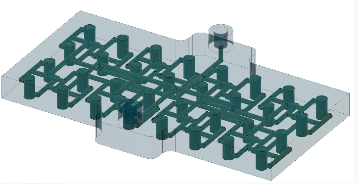

# PhenoChip

3D-printable and laser-cuttable flow-through culture devices for aquatic organisms.

### PhenoChip: Open flow-through culture devices for imaging aquatic organisms

PhenoChip is an open hardware platform for creating **flow-through culture and imaging devices for aquatic organisms**.

The repository contains designs spanning different organism sizes and experimental requirements, using two complementary fabrication approaches:

- **Laser-cut devices** — rapid, inexpensive fabrication from stacked sheet materials
- **DLP-printed devices** — higher geometric complexity and miniaturisation through resin 3D printing

The aim is to provide adaptable culture environments that maintain animals under controlled flow while enabling unobstructed optical imaging.

---



## Concept

Many approaches to automated phenotyping and behavioural imaging require organisms to remain in a defined imaging region for extended periods while maintaining appropriate environmental conditions.

PhenoChip devices combine:

**continuous flow + organism retention + optical access**

into compact, reproducible culture chambers.

Rather than defining a single device, PhenoChip provides a set of design principles and fabrication approaches that can be scaled to organisms with very different body sizes.

---

## Device families

### Laser-cut PhenoChip

Layered devices fabricated from laser-cut sheet materials.

Best suited to:
- larger organisms
- rapid prototyping
- inexpensive fabrication
- easily modified chamber dimensions
- experiments requiring large optically clear surfaces

<p align="center">
  [PHOTO / EXPLODED DIAGRAM]
</p>

`hardware/laser-cut/`

---

### DLP PhenoChip

Monolithic or multi-component devices fabricated using high-resolution DLP resin printing.

Best suited to:
- small organisms
- fine flow features
- complex internal geometries
- highly repeatable devices
- dense culture/imaging configurations

<p align="center">
  [PHOTO / RENDER]
</p>

`hardware/dlp/`

---

## Scaling across organisms

PhenoChip is designed around the **organism rather than a fixed device format**.

| Scale | Example chamber size | Fabrication | Typical application |
|---|---|---|---|
| Small | µm–mm | DLP | larvae / small invertebrates |
| Medium | mm–cm | DLP / laser cut | aquatic invertebrates |
| Large | cm+ | laser cut | larger invertebrates / early fish |

Device dimensions, retention structures, flow paths and optical geometry can be modified independently.

---

## Design principles

### 🌊 Flow-through culture
Continuous exchange of water or experimental media maintains environmental conditions without removing animals from the imaging system.

### 📷 Imaging access
Culture regions are designed around optical access, enabling longitudinal imaging, behavioural measurements and automated phenotyping.

### 📐 Scalable geometry
Chamber dimensions and flow features can be adapted to organism size and imaging requirements.

### 🛠 Open fabrication
Designs use accessible fabrication technologies and editable source files wherever possible.

### 🔬 Experimental flexibility
Devices can be adapted for different flow regimes, environmental manipulations, imaging systems and biological applications.

---

## Repository structure

```text
phenochip/
├── hardware/
│   ├── laser-cut/
│   │   ├── designs/
│   │   ├── fabrication/
│   │   └── examples/
│   │
│   └── dlp/
│       ├── designs/
│       ├── fabrication/
│       └── examples/
│
├── docs/
│   ├── design-guide/
│   ├── assembly/
│   └── imaging/
│
├── examples/
│   └── organisms/
│
└── README.md
```

---

## Getting started

Choose a device according to:

**organism size → imaging requirements → flow requirements → fabrication method**

Detailed fabrication and assembly instructions are provided within each device directory.

---

## Applications

PhenoChip devices are intended to support applications including:

- longitudinal imaging
- automated phenotyping
- developmental biology
- behavioural analysis
- ecotoxicology
- environmental physiology
- aquaculture research
- organism–environment experiments

---

## Contributing

PhenoChip is intended as a growing collection of open designs.

Contributions of new device geometries, organism-specific adaptations, fabrication methods and validated imaging configurations are welcome.

If you adapt a PhenoChip design for a new organism, consider contributing the design files and basic fabrication parameters so that others can reproduce it.

---

## Citation

If you use PhenoChip in published research, please cite:

> [Citation / DOI to be added]

---

## Licence

Hardware designs: [CERN-OHL / appropriate licence]

Documentation and other repository content: [licence]
